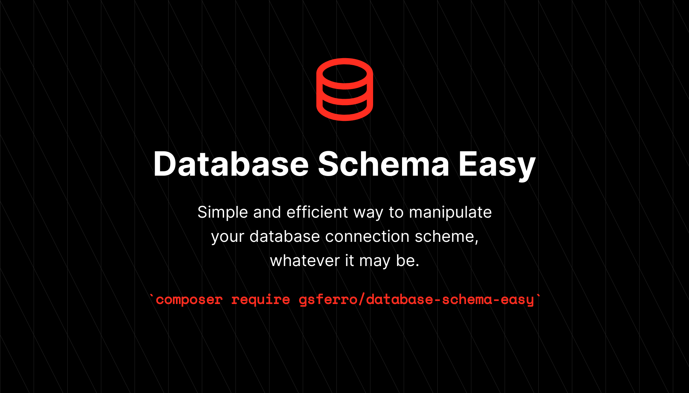

Simple and efficient way to manipulate your database connection scheme, whatever it may be.

### Instalação:

```composer 
composer require gsferro/database-schema-easy
```

### Dependências:

Package | Versão
--------|-----------
PHP | ^8
Laravel | ^8
Doctrine/orm | ^2.14

### Uso:

- Instancie o serviço
    ```text 
    $schema = new DatabaseSchemaEasy(string $table, string $connection = null);
    ```

- Facade
  ```text
  $schema = databaseSchema(string $table)
  ```

### Métodos:

- `hasTable(): bool`
    > Verifica se a table exists

- `getColumnListing(bool $includePrimaryKeys = true, bool $includeTimestamps = false): array`
    > Retorna todas as colunas da table

- `hasColumn(string $column): bool`
    > Verifica se a coluna exists

- `hasColumnsTimestamps(): bool`
    > Verifica se a coluna exists

- `hasColumns(array $columns): bool`
    > Verifica se as colunas exists

- `getTypeFromColumns(array $columns): array`
    > Pega todos os tipos das colunas

- `getColumnType(string $column): string`
    > Retorna o type da colunas

- `getDoctrineColumn(string $column): array`
    > Retorna todas as informações da colunas

- `isPrimaryKey(string $column): bool`
    > Verifica se a coluna é pk

- `primaryKeys(): array`
    > Retorna as chaves pks

- `hasModelWithTableName(string $table = null): bool|string`
    > Verifica se a table já existe model eloquent criada

- `getAllTables(): array`
    > Todas as tabelas da conexão
 
- `hasForeinsKey(string $column, bool $fromStubReplace = false): bool|array`
    > Verifica se a coluna é uma foreing key e devolve os dados do relacionamento